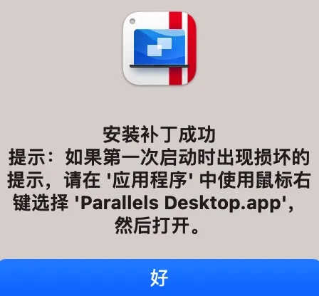
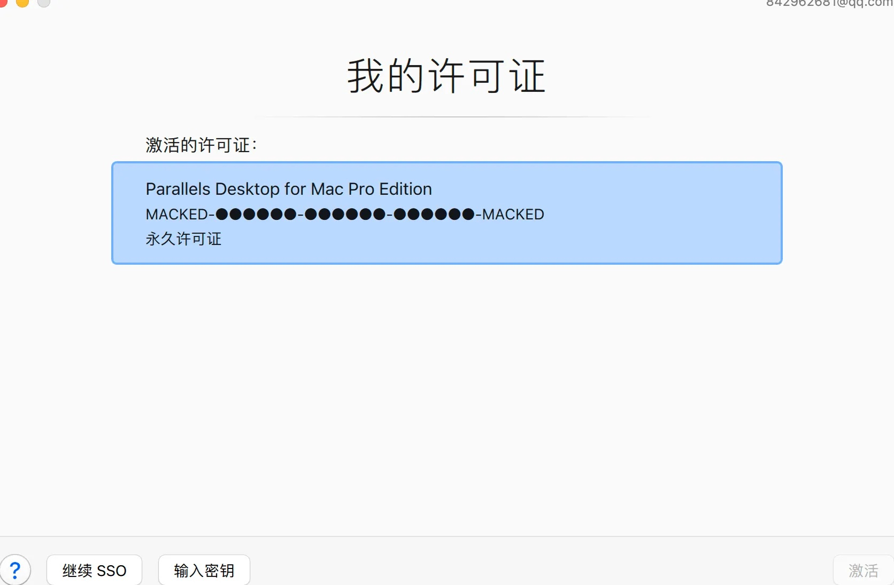

# Parallels Desktop 19.x 破解教程
### 包括最新版本 19.1.1 (54734)
### Mac最流行虚拟机软件破解教程
##### 本文只供学习交流使用

## PD19 永久授权激活教程
>本激活工具理论上直接可用，可以激活pd17、pd18、pd19版本
>
> 如提示因为出现问题而无法打开，请关闭SIP后再次尝试
> 
> 如提示已损坏，请参考 [“Mac应用”已损坏，打不开解决办法](https://www.macdo.cn/925.html)

## 永久激活步骤

#### 步骤一 在pd官网下载安装包并且安装，安装完成后退出pd，也可以直接点击下方地址下载。（按需下载所需版本)
19.0.0 : [https://download.parallels.com/desktop/v19/19.0.0-54570/ParallelsDesktop-19.0.0-54570.dmg](https://download.parallels.com/desktop/v19/19.0.0-54570/ParallelsDesktop-19.0.0-54570.dmg)

19.1.0 : [https://download.parallels.com/desktop/v19/19.1.0-54729/ParallelsDesktop-19.1.0-54729.dmg](https://download.parallels.com/desktop/v19/19.1.0-54729/ParallelsDesktop-19.1.0-54729.dmg)

19.1.1 ：[https://download.parallels.com/desktop/v19/19.1.1-54734/ParallelsDesktop-19.1.1-54734.dmg](https://download.parallels.com/desktop/v19/19.1.1-54734/ParallelsDesktop-19.1.1-54734.dmg)

#### 步骤二 下载激活工具

Q：2.x 、 3.x 和 4.x 版本的区别是什么？我该下载哪一个？
A：各版本说明如下. 
   
> 2.0 显示专业版, 需登录账号, Intel 通杀所有版本； 
>
> 2.1 显示专业版, 需登录账号, Intel 通杀所有版本,不支持ARM芯片；
> 
> 3.x 显示商业版, 只支持PD19.0，支持arm/intel；
>  
> 4.0 显示商业版, 只支持PD19.1.0版本，支持arm/intel，推荐!
>  
> 4.1 可以激活19.1.1版本，但是需要关闭sip，不推荐使用，关闭sip的教程可以自行百度谷歌一下。

2.0.0版本可以激活pd16-pd19所有版本（估计是只有intel芯片的机器能实现），但是3.0.0和4.0.0版本只能激活pd19版本。
另外一点就是2.0.0版本需要登录pd账号之后才能看到激活状态（不登录也一样是激活了的，只是单纯要登录才能显示激活信息），而3.0.0和4.0.0无需登录pd账号即可看到激活状态。

#### 步骤三 把工具移动到应用程序目录之后打开激活工具

#### 步骤四 运行激活工具后，点击弹出窗口的安装补丁按钮，输入密码即可。

#### 步骤五 激活之后再次打开pd，会报“请移动到废纸篓”，只需要打开访达，点击侧边栏的应用程序,找到pd，右键打开即可。（只有激活后第一次打开需要如此操作）

